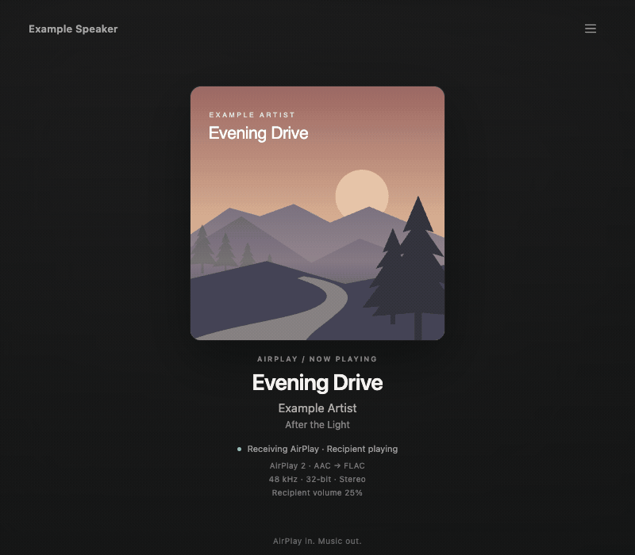

# airplay2-dlna-bridge

Send AirPlay audio from an iPhone or Mac to a UPnP/DLNA speaker or network player.
The bridge handles playback, speaker volume, track information, and cover art.
A built-in web page shows live playback status and logs.

Built for and tested on the WiiM Ultra. Other devices need FLAC playback over
HTTP and compatible UPnP control services. The bridge runs in two Docker
containers, with published images for Linux amd64 and arm64.

```text
iPhone / Mac → AirPlay → Shairport Sync → bridge → FLAC over HTTP → speaker
```

The bridge encodes received audio losslessly as FLAC. Source quality still
depends on the audio format sent over AirPlay.

## Quick start

Use a Docker host with Compose and host networking for AirPlay discovery and
timing. The sender, Docker host, and speaker must share a local network.
The supplied Shairport Sync container provides the AirPlay receiver.
Shairport Sync 5 or later is required for audio format metadata.

On the Docker host, create a deployment folder and download the configuration:

```bash
mkdir airplay2-dlna-bridge
cd airplay2-dlna-bridge
curl -fL https://raw.githubusercontent.com/leonroy/airplay2-dlna-bridge/main/docker-compose.yml -o docker-compose.yml
curl -fL https://raw.githubusercontent.com/leonroy/airplay2-dlna-bridge/main/shairport-sync.conf -o shairport-sync.conf
curl -fL https://raw.githubusercontent.com/leonroy/airplay2-dlna-bridge/main/.env.example -o .env
```

The deployment folder needs only these three files. Application code runs inside
the published images. Keep source checkouts and development files elsewhere.

Edit `.env` before starting the containers:

- Set `HOST_IP` to the Docker host's LAN address. The speaker fetches audio from this address.
- Set `RENDERER_IP` to the speaker's LAN address.
- Optionally uncomment `MAX_VOLUME` and set the maximum speaker volume that you want the sender to control.

Start the containers:

```bash
docker compose pull
docker compose up -d
```

Select “AirPlay 2 Bridge” from your iPhone or Mac's AirPlay menu and play audio.
Open `http://<HOST_IP>:8000/` for playback status.
If you change `STREAM_PORT`, use that port in the page URL.

## Playback behavior

Allow about 4–6 seconds of playback delay, depending on the sender and speaker.
With the default `DIDL_PUSH=1`, display updates can cause a 2–4 second audio gap
at track changes on WiiM/LinkPlay devices. Set `DIDL_PUSH=0` to prevent these
refreshes and keep the speaker display static. The web page still updates.

Do not group the bridge with native AirPlay 2 speakers. Its additional buffering
and independent speaker clock prevent synchronized playback across those rooms.
For WiiM/LinkPlay multiroom playback, group the speakers in the WiiM Home app,
then send AirPlay audio to this bridge as one endpoint.

## Playback status page



The animation uses fictional track, speaker, and log data.
The page shows artwork, track information, AirPlay version, playback state, and
volume. Separate Received and Output rows show the incoming audio format and the
FLAC stream sent to the recipient. Channel badges distinguish stereo (2.0), 5.1,
and 7.1 input from stereo output. It is read-only and sends no playback or volume commands.

With a receiver that provides `ssnc/abrt` and `ssnc/arst` metadata, the Received row
also shows the measured average AAC input bitrate. Connection details show session
totals for missing audio blocks, too-late blocks, and retry requests. These counters
are receiver observations, not a general network packet-loss measurement.
When these optional metadata messages are absent, bitrate is omitted and the
counters appear as unavailable.

Open the menu for connection details or live bridge logs. Logs follow new entries
until you scroll up. Select the new-entry button to resume following.
Press Escape to close a popup. The page respects reduced-motion preferences.

Status updates arrive every two seconds. Speaker observations refresh about
five seconds after each completed query and appear stale after 15 seconds.
Unsupported fields appear as unavailable. Input status describes received audio
and does not confirm that AirPlay discovery works.

The page pauses its connection when hidden and reconnects when visible.
Its logs cover the bridge process, not Shairport Sync or complete Docker output.
For sample data without live speaker queries, open `/?demo=playing`, `/?demo=idle`,
`/?demo=waiting`, or `/?demo=failure`.

## Configuration

### Compose settings

Use [.env.example](.env.example) as the template for `.env`.
The main settings are:

| Setting | Default | Purpose |
| --- | --- | --- |
| `HOST_IP` | Set for your network | Docker host address reachable by the speaker. |
| `RENDERER_IP` | Set for your network | Speaker address. Leave empty to disable automatic playback and volume control. |
| `AIRPLAY_VERSION` | `2` | Receiver mode: `1` for classic AirPlay or `2` for AirPlay 2. |
| `AIRPLAY_NAME` | `AirPlay 1 Bridge` or `AirPlay 2 Bridge` | Name shown in the sender's AirPlay menu, according to the selected version. |
| `MAX_VOLUME` | `100` | Speaker volume when the sender is at full volume, on a 0–100 scale. |
| `DIDL_PUSH` | `1` | Refresh track information on the speaker display. See [Playback behavior](#playback-behavior). |
| `STREAM_PORT` | `8000` | Host port for audio, artwork, and the status page. |
| `BRIDGE_IMAGE_TAG` | `latest` | Published bridge version. Release tags omit the leading `v`. |

Apply `.env` changes with `docker compose up -d` on the Docker host.
To rename the AirPlay endpoint, set `AIRPLAY_NAME="Living Room"` in `.env`.
The receiver mode and name come from `.env` for both AirPlay versions.

Keep the supplied `shairport-sync.conf` for ordinary installations.
It contains only bridge-specific settings: pipe output, shared audio and metadata
paths, automatic audio rate and format selection, and speaker volume handling.
Shairport supplies stereo output, enabled metadata and artwork, the session
timeout, and normal logging from its [defaults](https://github.com/mikebrady/shairport-sync/blob/master/scripts/shairport-sync.conf).
The receiver image also provides
the standard configuration path and receiver ports.

If upgrading from `SHAIRPORT_COMMAND`, remove that line from `.env`.
For a classic receiver, replace it with `AIRPLAY_VERSION=1`.
Move any custom name from the old command or `general.name` to `AIRPLAY_NAME`.
Retain your `STREAM_PORT`.
Download the updated Compose and Shairport configuration files before running
`docker compose up -d`. The old command variable is no longer used.
Preserve any custom fixed PCM settings in the updated configuration file.
If you used `docker-compose.airplay1.yml`, switch to the main Compose file with
`AIRPLAY_VERSION=1` in `.env`.

Speaker control uses the fixed UPnP description port `49152`.
Seek and pause do not force audio connections to close.
If automatic control is disabled, open `http://<HOST_IP>:<STREAM_PORT>/stream.flac`
on the speaker manually.

### Updates and rollback

Set `BRIDGE_IMAGE_TAG` in `.env` to pin a published release or select an earlier
version for rollback. On the Docker host, apply that version with:

```bash
docker compose pull bridge
docker compose up -d bridge
```

After replacing the bridge, disconnect and reconnect AirPlay to send fresh audio
format metadata. See [RELEASING.md](RELEASING.md) for image publishing and release details.

### Separate AirPlay 1 and AirPlay 2 endpoints

For an additional classic AirPlay 1 endpoint, use a separate deployment folder and `.env`.
Set the host and speaker addresses there. Add these lines to the AirPlay 1 `.env`:

```dotenv
AIRPLAY_VERSION=1
STREAM_PORT=8001
```

Keep the AirPlay 2 deployment on port `8000`.
Both deployments use the same `docker-compose.yml` from the repository.
Compose assigns container names from each deployment folder's project name.
Use different folder names for the two deployments.
Run these commands from the AirPlay 1 folder:

```bash
docker compose pull
docker compose up -d
```

The AirPlay 1 endpoint advertises “AirPlay 1 Bridge” on RTSP port `5000`.
The ordinary AirPlay 2 endpoint uses RTSP port `7000`.
Shairport chooses these receiver ports from the selected mode. They are separate
from `STREAM_PORT`, which serves audio and the web page.
Each deployment has separate containers and an audio volume.
If both target one speaker, select one endpoint at a time. The bridge processes
do not coordinate speaker ownership.

## Troubleshooting

On the Docker host, follow both containers when reproducing a problem:

```bash
docker compose logs --timestamps --follow bridge shairport-sync
```

If the speaker cannot fetch audio, make sure that it can reach `HOST_IP` on
`STREAM_PORT`. Use `/stream.flac` for playback or `/stream.wav` for diagnostic audio.
An HTTP 503 response means that audio is not ready or a connection or encoder limit is reached.

If the page waits for an audio format, make sure that the shared metadata pipe
is configured in `shairport-sync.conf`. Metadata is enabled by default in the
supplied receiver image. If you disabled it, remove that override.
Logs identify incoming format as `sdsc` and pipe output format as `odsc`, with session IDs, byte counts,
and rejection reasons.

For startup delays, inspect the `timing` records for `playback_ready`,
`command_start`/`command_end`, `flac_connected`, `flac_pcm`, and `flac_frame`.
Command success confirms a valid speaker response. The first FLAC frame is
measured before socket writing, so neither measure confirms audible playback.

## Advanced details

### PCM output format

PCM is uncompressed sample audio. Shairport Sync selects the pipe output format,
and the bridge reads its `ssnc/odsc` metadata to configure encoding and buffers.
The supplied configuration uses automatic sample rate and format selection,
with stereo output.

To use fixed 24-bit/48 kHz stereo output, set these values in the `pipe` block of
`shairport-sync.conf`, then restart the receiver and reconnect AirPlay:

```conf
output_rate = 48000;
output_format = "S24_3LE";
```

The bridge accepts ten integer sample formats, including big-endian and padded
24-bit formats, with mono or stereo output. Full 32-bit FLAC requires FFmpeg's
experimental encoder support and a compatible speaker.

Playback waits for a session start and valid output metadata. Early audio is
buffered up to 4 MiB. Format changes are accepted between sessions. A format
change within one session stops playback because metadata gives no audio byte
offset. The bridge cannot detect unannounced format changes.

### Connection and resource limits

These limits apply per bridge process and are configurable through `.env`:

| Setting | Default | Limit |
| --- | --- | --- |
| `HTTP_MAX_CONNECTIONS` | `16` | All HTTP connections, including incomplete requests. |
| `FLAC_MAX_ENCODERS` | `4` | Simultaneous FFmpeg processes for FLAC streams. |
| `HTTP_HEADER_TIMEOUT` | `5` | Seconds without progress while receiving request headers. |
| `HTTP_HEADER_DEADLINE` | `10` | Total seconds allowed for the request line and headers. |

All four values must be positive integers. Excess requests receive HTTP 503.
Header deadlines end before audio streaming, so they do not interrupt playback pauses.

Live status allows up to eight viewers and reserves one HTTP slot for audio.
With `HTTP_MAX_CONNECTIONS=1`, live status connections are disabled.
Log history holds up to 500 entries or 512 KiB, with a 4 KiB limit per message.
Expired entries are skipped, and history resets when the bridge restarts.

Metadata has fixed memory limits. Each item accepts up to 8 MiB of decoded data
and 12 MiB of raw input, including XML and base64 text. Each track field accepts
up to 4 KiB of UTF-8 text. Each cover accepts up to 4 MiB. The artwork cache holds
up to 16 covers or 16 MiB, whichever limit it reaches first.

The reader discards invalid items and resumes at the next item. It rejects
invalid base64, mismatched declared lengths and values above these limits.
The reader skips rejected items without ending an active audio session.
Valid items can span pipe reads.

### Initial playback timing

With a track title available, initial playback waits for 0.5 seconds without a
metadata change. Without a title, it waits two seconds. Later display updates
also wait two seconds to combine related metadata changes into one push.
Late artwork can still cause another stream restart when `DIDL_PUSH=1`.

## Development and tests

To build the checked-out source, use the development Compose override:

```bash
docker compose -f docker-compose.yml -f docker-compose.dev.yml up -d --build
```

For backend tests, use Python 3.12 or 3.13 with FFmpeg installed:

```sh
python -m pip install -r requirements-dev.txt
python -m pytest -q
```

Browser tests use synthetic events and do not contact a speaker.
They cover logs, artwork, connection recovery, responsive layout, and keyboard controls.
Install Playwright and Chromium to run them:

```sh
python -m pip install -r requirements-dev.txt -r requirements-browser.txt
python -m playwright install chromium
python -m pytest tests/test_log_browser.py -q
```

To use an existing Chromium-based browser, set `PLAYWRIGHT_CHROMIUM_EXECUTABLE`
to its executable path. The main suite skips browser tests when Playwright is absent.

## Credits and license

[Shairport Sync](https://github.com/mikebrady/shairport-sync) provides AirPlay
reception and its bundled timing service, nqptp.
[AirConnect](https://github.com/philippe44/AirConnect) inspired the UPnP control approach.
This project uses the [MIT license](LICENSE).
